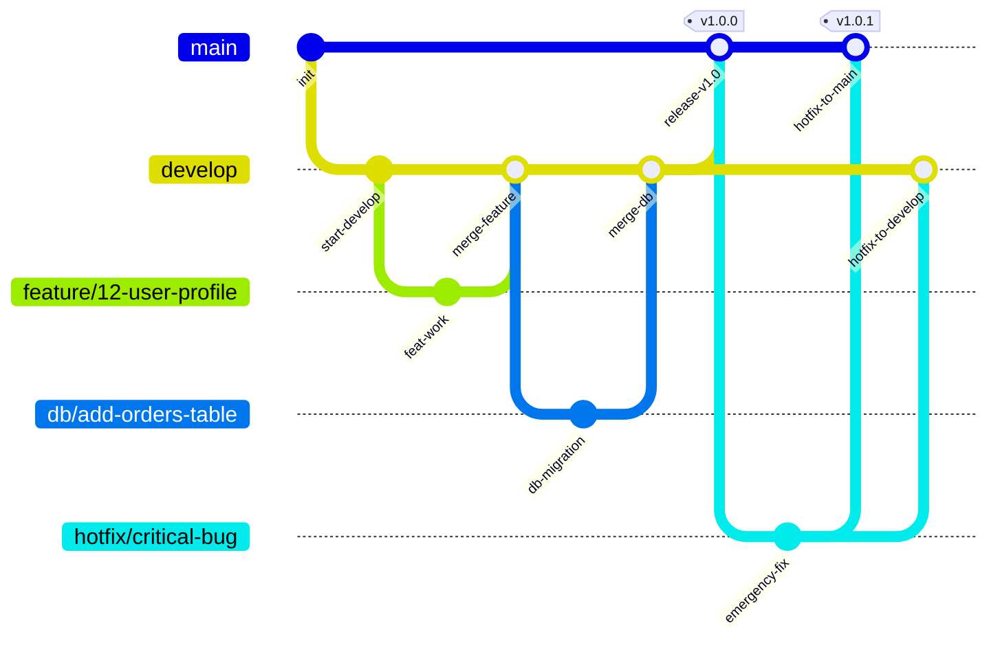
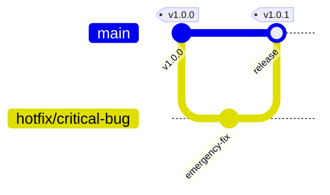

# Git 運用ガイドライン

本プロジェクトでは，品質の高いコードを安定してリリースするために，以下の Git ブランチ戦略を採用する．
チーム全員がこのフローを遵守することで，手戻りのない効率的な開発を目指す．

---

## 1. ブランチ戦略の概要

本プロジェクトでは，以下のブランチを役割に応じて使い分ける．

### メインブランチ

| ブランチ名 | 役割 | 権限・ルール |
| :--- | :--- | :--- |
| **`main`** | **本番環境 (Production)**<br>常にリリース可能な安定した状態を保つ． | **Commit / Push 禁止**<br>原則として `develop` または `hotfix/*` からの PR マージのみで更新する． |
| **`develop`** | **開発検証環境 (Staging)**<br>次期リリースのための統合ブランチ．機能開発が完了したらここにマージする． | **Commit / Push 可能**<br>基本的には作業ブランチからの PR マージで更新するが，軽微な修正等は直接 Push も許容できる． |

### 作業ブランチ

| ブランチ名 | 用途 | 例 |
| :--- | :--- | :--- |
| **`feature/*`** | 新機能の追加や改善 | `feature/12-user-profile` |
| **`fix/*`** | 開発中に発見されたバグの修正 | `fix/15-login-error` |
| **`hotfix/*`** | 本番環境の緊急バグ修正<br> `main` から分岐 → `main` と `develop` 両方にマージ | `hotfix/critical-payment-bug` |
| **`db/*`** | DBスキーマ変更・マイグレーション | `db/add-orders-table` |
| **`refactor/*`** | ディレクトリ構造変更・大規模なコード整理 | `refactor/reorganize-api-structure` |
| **`other/*`** | その他の変更（AIコマンドやAGENTS.mdの追加・変更など） | `other/new_cursor_commands` |

### 命名規則

```
<prefix>/<issue番号>-<簡潔な説明>
```

- **issue番号がある場合**: `feature/12-user-profile`
- **issue番号がない場合**: `hotfix/critical-payment-bug`

### ブランチフロー早見表

| プレフィックス | 分岐元 | マージ先 |
| :--- | :--- | :--- |
| `feature/` | `develop` | `develop` |
| `fix/` | `develop` | `develop` |
| `hotfix/` | **`main`** | **`main` + `develop`** |
| `db/` | `develop` | `develop` |
| `refactor/` | `develop` | `develop` |



---

## 2. 開発フロー詳細

日々の開発は，基本的に以下のサイクルで行う．

### Step 1: 最新の `develop` を取得する

作業を始める前に，必ず `develop` ブランチを最新の状態にする．

```bash
# develop ブランチに切り替え
git checkout develop

# リモートの最新情報を取得
git pull origin develop
```

### Step 2: 作業用ブランチの作成

`develop` ブランチから，新しい作業用ブランチを作成する．
作業内容に応じて適切なプレフィックスを選択する．

```bash
# 機能追加の場合
git checkout -b feature/12-user-profile

# バグ修正の場合
git checkout -b fix/15-login-error

# DB変更の場合
git checkout -b db/add-orders-table

# リファクタリングの場合
git checkout -b refactor/reorganize-api-structure
```

### Step 3: 実装とコミット

コードを編集し，変更をコミットする．
こまめにコミットすることで，作業履歴が追いやすくなる．

```bash
# 変更ファイルをステージング
git add .

# コミット（メッセージは具体的に）
git commit -m "feat: 企業カードの表示"
```

> **Tip**: コミットメッセージのプレフィックス
> - `feat:` 新機能の追加
> - `fix:` バグの修正
> - `docs:` ドキュメントのみの変更
> - `refactor:` 出力結果が変わらないコード改善
> - `db:` データベース関連の変更
> - `chore:` 開発環境に関する変更

### Step 4: リモートへプッシュ

作業が一区切りついたら，リモートリポジトリへプッシュする．

```bash
# 初回プッシュ時（上流ブランチを設定）
git push origin feature/12-user-profile
```


## 3. 作業ブランチの最新化（developの取り込み）

開発が進むと，他のメンバーの変更が `develop` ブランチにマージされていく．
しかし，**誰かが `develop` を更新しても，あなたの手元の作業ブランチは自動的には更新されない**．

そのため，以下のタイミングで**自ら最新の `develop` を取り込む作業**を行う必要がある．

- **推奨タイミング**:
  1. その日の作業を始めるとき
  2. 自分の作業が一段落して，コミットした後
  3. プルリクエストを出す直前

### 具体的な手順

以下の2ステップで，安全に最新の状態を取り込むことができる．

#### Step 1: 手元の `develop` を最新にする

まず，ローカルの `develop` ブランチをリモートの最新状態に更新する．

```bash
# 1. develop ブランチに移動
git checkout develop

# 2. リモートの最新情報を develop に持ってくる
git pull origin develop
```

> **Note**: この時点では，手元の `develop` が最新になっただけで，**作業中のブランチはまだ古いまま**．

#### Step 2: 最新の `develop` を作業ブランチにマージする

最新になった `develop` の内容を，作業中のブランチに取り込む．

```bash
# 1. 自分の作業ブランチに戻る
git checkout feature/12-user-profile

# 2. 最新の develop を今のブランチに取り込む（マージ）
git merge develop
```

これで，作業中のブランチに他のメンバーの変更（最新の `develop`）が反映される．
もしコンフリクト（競合）が発生した場合は，[トラブルシューティング](#6-トラブルシューティング)を参照．

---

## 4. リリースフロー (`develop` → `main`)

`develop` ブランチで十分にテストが行われ，本番環境へリリースする準備が整ったら，`main` ブランチへ反映する．

1. **PR 作成**: `develop` から `main` へのプルリクエストを作成．
2. **最終確認**: ステージング環境等で動作に問題がないか確認．
3. **マージ**: `main` へマージし，本番環境へデプロイ．

---

## 5. 緊急修正フロー（Hotfix）

本番環境で緊急のバグが発見された場合，通常の開発フローを待たずに修正をリリースする．



### 手順

#### Step 1: `main` から hotfix ブランチを作成

```bash
git checkout main
git pull origin main
git checkout -b hotfix/critical-bug-description
```

#### Step 2: 修正をコミット・プッシュ

```bash
git add .
git commit -m "hotfix: 緊急バグの修正"
git push origin hotfix/critical-bug-description
```

#### Step 3: `main` へ PR を作成してマージ

- **最優先でレビュー**を行い，承認後すぐにマージ．
- マージ後，本番環境へデプロイ．

#### Step 4: `develop` へも同じ修正を反映

hotfix の修正が `develop` に漏れないよう，必ず `develop` にもマージ．

```bash
git checkout develop
git pull origin develop
git merge hotfix/critical-bug-description
git push origin develop
```

> **重要**: hotfix を `develop` にマージし忘れると，次回リリース時に同じバグが再発する．

---

## 6. トラブルシューティング

### コンフリクト（競合）が発生した場合

`develop` ブランチが他の人の変更で進んでしまい，自分のブランチと競合することがある．
その場合は，自分のブランチに最新の `develop` を取り込んで解消する．

```bash
# 自分のブランチにいる状態で実行
git pull origin develop

# コンフリクトが発生したファイルが表示されるので，エディタで修正する
# 修正後，再度 add と commit を行う
git add <修正したファイル>
git commit -m "merge: developとのコンフリクトを解消"
git push
```